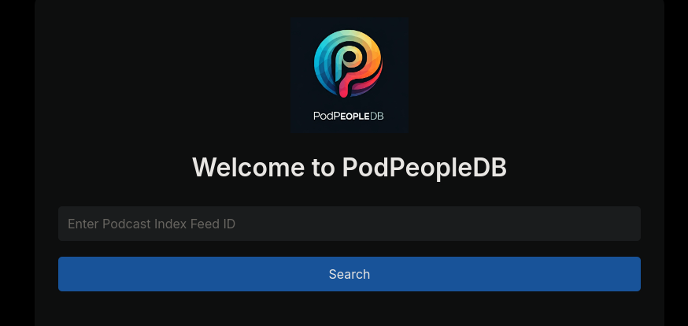
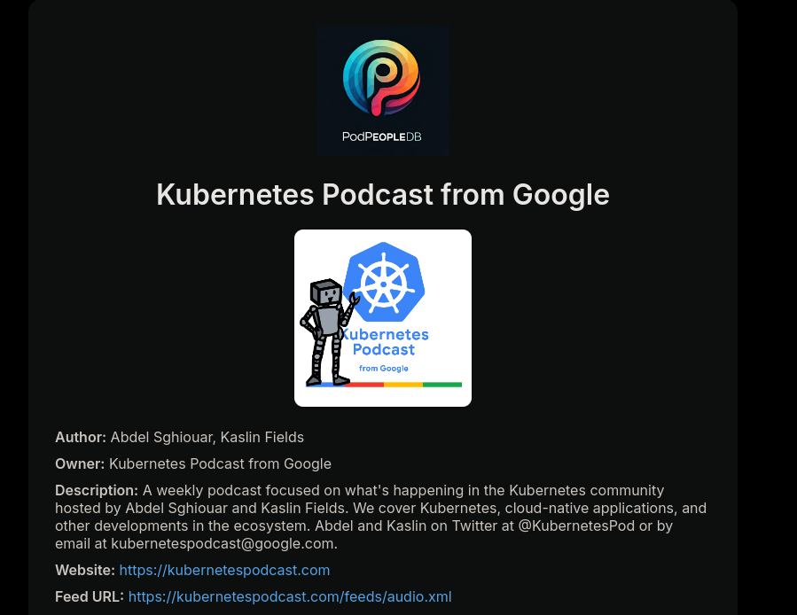

# PodPeopleDB: Building the IMDB of Podcasting


In the ever-expanding universe of podcasting, there's been a crucial piece missing from the puzzle: Standardization. While this can cause some challenges, it does allow the podcasting space to be accessible, and open to all. This does however mean that some features tend to be difficult to implement when building a podcast client, and some podcasts implement certain tags and features into their feeds while others leave them out entirely; especially as the Podcasting 2.0 standard has begun rolling out. A lack of governing body has meant that in the podcasting space adoption is a slow curve as some podcasts get onboard with the new features and others don't even have them on their radar. That's where PodPeopleDB comes in - an open-source project designed to bridge this gap and enhance the podcast discovery experience with the help of the community.

## The Problem with Podcast Discovery

The podcasting ecosystem has evolved tremendously over the years, with excellent tools for finding shows by topic, name, or category. [Around 2003](https://www.descript.com/blog/article/history-of-podcasts) Dave Winer embeded an audio file in an RSS feed, and Apple became quick to adopt it and build audio based feeds into the budding world of the iPod. Frankly, Apple did a good job with this when building out the standard because they left it relatively open. It does mean however that to this day there's leftover remnants of itunes all over in a standard Podcast feed. See the example below:

```
<rss xmlns:itunes="http://www.itunes.com/dtds/podcast-1.0.dtd" xmlns:content="http://purl.org/rss/1.0/modules/content/" xmlns:media="http://search.yahoo.com/mrss/" version="2.0">
<channel>
<title>Up First from NPR</title>
<link>https://www.npr.org/podcasts/510318/up-first</link>
<description>
Some Stuff goes here
</description>
<copyright>Copyright 2015-2021 NPR - For Personal Use Only</copyright>
<generator>NPR Feed Publish Service v1.17.11</generator>
<language>en-us</language>
<itunes:author>NPR</itunes:author>
<itunes:block>no</itunes:block>
<itunes:owner>
<itunes:email>podcasts@npr.org</itunes:email>
<itunes:name>NPR</itunes:name>
</itunes:owner>
<itunes:category text="News">
<itunes:category text="Daily News"/>
</itunes:category>
<itunes:image href="https://media.npr.org/assets/img/2022/09/23/up-first_tile_npr-network-01_sq-cd1dc7e35846274fc57247cfcb9cd4dddbb2d635.jpg?s=1400&c=66&f=jpg"/>
<itunes:type>episodic</itunes:type>
<image>
<url>https://media.npr.org/assets/img/2022/09/23/up-first_tile_npr-network-01_sq-cd1dc7e35846274fc57247cfcb9cd4dddbb2d635.jpg?s=1400&c=66&f=jpg</url>
<title>Up First from NPR</title>
<link>https://www.npr.org/podcasts/510318/up-first</link>
</image>
```
Notice all the itunes references all over in this example feed. One of the most difficult parts of creating a podcast client has been ensuring my client works for as many podcast feeds as possible since they are all so different. The Podcast Index for the past few years has been trying to change this, by ensuring a consistent but open standard for podcast feeds to adopt. This is a slow process, especially in the eyes of some of the large corporations that publish and profit off podcasts. 

One of the greatest features of the Podcasting 2.0 standard is the Person tag. Which allows creators to add hosts and guest information to podcasts and individual episodes. This makes following specific hosts or guests across different shows possible, and without mass adoption of this tag in the show feeds you'll end up manually searching via google for other podcasts a particular host is a part of.

## Enter PodPeopleDB

PodPeopleDB is designed as a complement to the Podcast 2.0 movement, specifically supporting the [podcast:person tag](https://podcasting2.org/podcast-namespace/tags/person) initiative. While this tag allows podcasts to include host and guest information directly in their feeds, adoption takes time. PodPeopleDB serves as a community-driven bridge, providing this crucial metadata for podcasts that haven't yet implemented the tag. Imagine subscribting to your favorite host and following them as they make guest appearances on various other podcasts you have yet to hear about in the first place. This is possible, and with Pinepods and the help of you, is already done.

### Key Features and Benefits

- **Community-Driven Data**: Listeners can submit host and guest information for their favorite shows, building a comprehensive database of podcast personalities

- **Automatic Integration**: Seamlessly imports data from feeds already using the podcast:person tag. I'm not stepping on the toes of the Podcast Index. For podcasts that already use the Person tag you can't even add hosts. If every podcast used the Person tag (not happening anytime soon) this would be a dead project.

- **Open API**: Free access for podcast apps and developers to enhance their discovery features. I develop, breathe and sleep open-source. If you want to access the PodPeopleDB API they are here free, and documented. If you want to host your own instance of it, download the existing database and go for it. This project and all it's data belongs to the community, I just maintain it.

- **Self-Hostable**: See above, Complete control over the data with easy Docker deployment

- **Fallback System**: Provides host data when it's not available in the podcast feed directly. (Guest data for episodes is in the works)

- **Real-Time Updates**: Notifications via ntfy for new submissions and updates. As the creator I get these as well as anyone else I make an admin. 

## Why This Matters

Think about how IMDB transformed movie discovery. Before IMDB, following an actor's career or finding all movies by a specific director was a challenge. PodPeopleDB aims to bring this same level of interconnected discovery to podcasting.

For podcast listeners, this means:

- Finding all appearances of their favorite people across different shows

- Discovering new shows through host connections

- Following podcast hosts as they launch new projects

For podcast creators:

- Better visibility for their content through host/guest connections

- Improved discoverability without requiring immediate feed modifications

- Simple integration with existing podcast platforms (Open API)

There's a lot of oppurtunity for federation between instances, or graphing host data between podcasts, especially since the entire database it a one click download away.

## Getting Started

Whether you're a podcast app developer looking to integrate host/guest data, a podcast listener wanting to contribute information, or a platform operator interested in hosting your own instance, PodPeopleDB is designed to be accessible and easy to use. The entire platform is built off the podcastindex throughout. If you go to the [PodpeopleDB website](https://podpeopledb.com) you'll be asked to provide a podcast index id. 



Entering an id will take you to a page for that particular podcast where you can submit host information. 



Note: It's much easier to just open a particular podcast in Pinepods where you'll be presented with the option to click a link directly to this page.

## Development

The project is actively seeking contributors and feedback from the podcast community. Check out the [GitHub repository](https://github.com/madeofpendletonwool/podpeople-db) to get started, or visit the [documentation](https://podpeopledb.com) for integration guides and API documentation.

Additional features yet to come:

- Individular Guest Episode support (Currently just hosts are supported in this initial implementation)

You can also check the issues on the [PodPeopleDB repo](https://github.com/madeofpendletonwool/podpeople-db/issues)

## Looking Forward

While we wait for more Podcasts to implement the features built by the Podcasting 2.0 movement building this community driven bridge will ensure it's always free to implement all the greated features into every Podcasting client. Let's build this now before another company looking to profit off it builds it out instead. Podcasting can be a great experience with the option to find your favorite personalities wherever they decide to get on a mic.

## Integration with PinePods: A Perfect Partnership

PodPeopleDB was designed with deep integration in mind, and nowhere is this more evident than in its seamless connection with PinePods, the open-source podcast manager. When used together, these platforms create a powerful podcast discovery and management system:

- **Automatic Host Discovery**: PinePods automatically queries PodPeopleDB when displaying podcast information, enriching show details with comprehensive host data

- **Enhanced Search Capabilities**: PinePods users can subscribe to hosts, following them everywhere they go. Whether or not they are subscribed to a given podcast already.

- **Unified Self-Hosting**: Both platforms can be easily self-hosted together using Docker, sharing infrastructure and simplifying deployment. You can also simply use Pinepods and the hosted instance of PodPeople that I provide. This means less for you to worry about, and you can give back to the community as you contribute host information for your favorite shows.

- **Shared Philosophy**: Both projects embrace open-source values and community-driven development, working together to improve the podcast listening experience

If you have a podcast client of your own, whether paid or free, I invite you to implement the PodPeopleDB into it. The name of the game here is to ensure the listener gets a better experience, not locked down to the specific platform for that better experience.

## Complementing Podcast 2.0: Building Bridges, Not Walls

While PodPeopleDB might seem to overlap with Podcast 2.0's person tags, I want to stress it's actually designed to complement and support this important initiative. Here's how:

### Supporting the Transition

- **Fallback System**: When a podcast hasn't implemented person tags yet, PodPeopleDB provides the missing metadata

- **Seamless Migration**: As podcasts adopt person tags, PodPeopleDB automatically transitions to using the official feed data

- **No Lock-in**: PodPeopleDB encourages podcasters to implement person tags by making the transition smooth and beneficial

### Enhancing the Ecosystem

- **Historical Data**: Maintains information for older episodes that might not have person tags

- **Community Verification**: Provides a way for listeners to verify and supplement official person tag data

- **Extended Metadata**: Offers additional information that might not fit within the person tag specification - Descriptions of given hosts namely.

### Best of Both Worlds

PodPeopleDB takes a "yes, and" approach rather than an "either/or" stance. It recognizes that:

- Some podcasts may take time to implement person tags

- Older episodes might never be updated with new tags

- Community input can enhance official metadata

- Different use cases might require different approaches to host/guest data