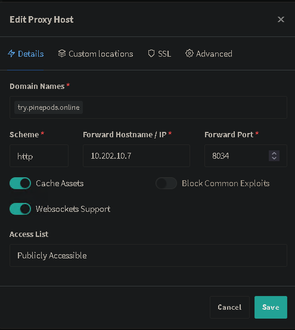
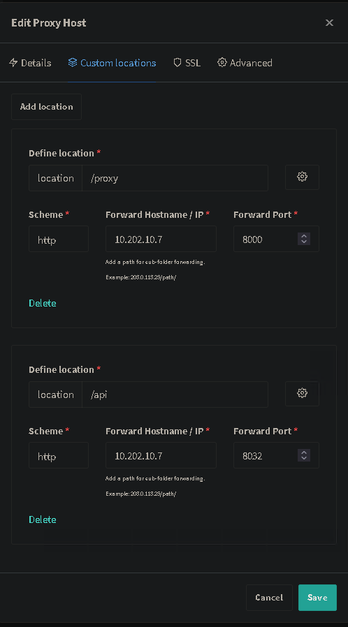
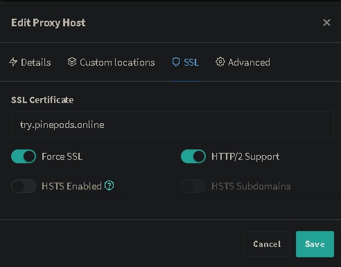

# Reverse Proxy Configuration

## Nginx

### Pinepods 
Coming Soon

### Pinepods Search API
Coming Soon

## Nginx Proxy Manager

### Pinepods 
- Setting up Pinepods on NPM Is hoenstly a snap. Super quick and easy. First of all, decide on a domain name of your choosing. Perhaps something along the lines of pods.*yourdomain.com*? Regardless, once you've decided on that, create a new proxy host in NPM. Whatever you set the web portal port in the compose file should be your main forward port. Default is 8034. So you want something like this:



As you can see, Pinepods uses assets and Websockets. So be sure to also enable that. 

- Next, on the custom locations page, configure 2 locations. One for /proxy, and one for /api. Proxy is for the image proxy to work correctly with client versions and /api is for the fastapi server to respond properly.


- Lastly, Let's configure the ssl portion. On the SSL tab of your proxy host simply requrest the cert (After configuring your site DNS) and turn on the ForceSSL and HTTP/2 Support options


### Pinepods Search API
Coming Soon

## Traefik

### Pinepods 
For Pinepods to be functioning behind a reverse proxy there are three services that will need to be allocated a subdomain each.
  1. Pinepods Webui - `https://pinepods.server.tld`
  2. Pinepods Proxy - `https://pinepods-proxy.server.tld`
  3. Pinepods Client API - `https://pinepods-api.server.tld`

The below labels will run the above format in Traefik with an entry point of `websecure`

```yaml
        labels:
            # Pinepods Webui
            - "traefik.http.routers.pinepods.entrypoints=websecure"
            - "traefik.http.routers.pinepods.service=pinepods"
            - "traefik.http.routers.pinepods.rule=Host(`pinepods.server.tld`)"
            - "traefik.http.services.pinepods.loadbalancer.server.port=8034"
            # PinePods Proxy
            - "traefik.http.routers.pinepods-proxy.entrypoints=websecure"
            - "traefik.http.routers.pinepods-proxy.service=pinepods-proxy"
            - "traefik.http.routers.pinepods-proxy.rule=Host(`pinepods-proxy.server.tld`)"
            - "traefik.http.services.pinepods-proxy.loadbalancer.server.port=8000"
            # Pinepods Client API
            - "traefik.http.routers.pinepods-api.entrypoints=websecure"
            - "traefik.http.routers.pinepods-api.service=pinepods-api"
            - "traefik.http.routers.pinepods-api.rule=Host(`pinepods-api.server.tld`)"
            - "traefik.http.services.pinepods-api.loadbalancer.server.port=8032"
```

### Pinepods Search API
There's no absolute need to put the [Search API container](https://www.pinepods.online/docs/API/search_api) behind a reverse proxy unless you intend to use the Pinepods client externally, as it can be run locally for access only to your own Pinepods instance, however if you wish to make the API availeble on WAN then the below labels will run an instance on `https://pinepods-seach-api.server.tld`
```yaml
        labels:
            # Pinepods Search API
            - "traefik.http.routers.pinepods-search-api.entrypoints=websecure"
            - "traefik.http.routers.pinepods-search-api.service=pinepods-search-api"
            - "traefik.http.routers.pinepods-search-api.rule=Host(`pinepods-search-api.server.tld`)"
            - "traefik.http.services.pinepods-search-api.loadbalancer.server.port=5000"
```

Within your Pinepods docker compose file the variable `API_URL` should then be set as 
```
API_URL=https://pinepods-search-api.server.tld/api/search`
```

## Caddy

### Pinepods 
Coming Soon

:::caution

This caddy config has not yet been fully tested. If you try it and it works, please, [open a PR](https://github.com/madeofpendletonwool/Pinepods-Docs/pulls)!

:::
```
proxy.pinepods.home.arpa:80 {
	reverse_proxy pinepods:8033
	log {
		output file /var/caddy/log/pinepods/proxy {
			roll_keep 2
			roll_size 10mb
			roll_keep_for 48h
		}
	}
}

api.pinepods.home.arpa:80 {
	reverse_proxy pinepods:8032
	log {
		output file /var/caddy/log/pinepods/api {
			roll_keep 2
			roll_size 10mb
			roll_keep_for 48h
		}
	}
}

pinepods.home.arpa:80 {
	reverse_proxy pinepods:8034
	log {
		output file /var/caddy/log/pinepods/web {
			roll_keep 2
			roll_size 10mb
			roll_keep_for 48h
		}
	}
}
```

### Pinepods Search API

```
search.pinepods.home.arpa:80 {
	reverse_proxy pinepods:5000
	log {
		output file /var/caddy/log/pinepods/search {
			roll_keep 2
			roll_size 10mb
			roll_keep_for 48h
		}
	}
}
```